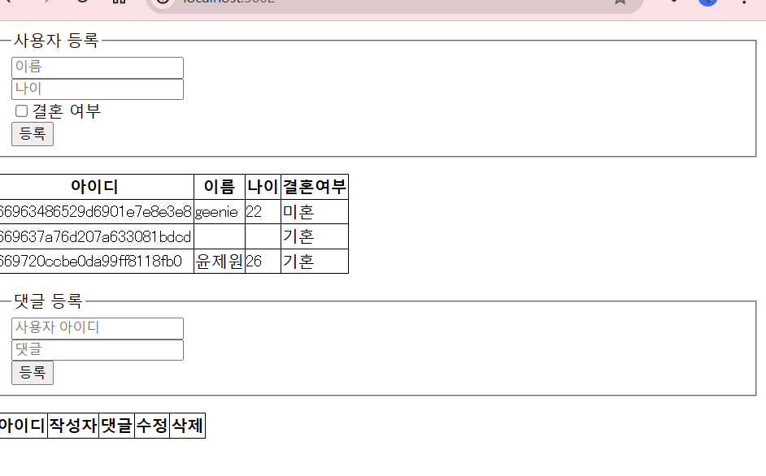

### mongodb

- 설치: mongodb, mongosh, 컴퍼스
- 데이터베이스 및 컬렉션 생성하기 : > 몽고디비 프롬프트 접속 하여 생성 , 또는 컴퍼스로 직접 생성 가능 >admin> use nodejs;
  switched to db nodejs
  nodejs> show dbs;
  admin 132.00 KiB
  config 108.00 KiB
  local 72.00 KiB
  nodejs> db
  nodejs
  nodejs>
- 컬렉션 생성하기: 따로 생성할 필요 X. 다큐먼트를 넣는 순간 컬렉션도 자동 생성됨. 직접 생성하는 명령어도 있음

  > db.createCollection()
  >
  > > 항상 mongosh 들어가면 정확한 데이터베이스에 접속해야 함

### 명령어 + 특성

- mongodb의 PK: (예시)
  nodejs> db.users.insertOne({name: 'geenie', age:22, married:false, comment: '안녕하세요 간단히 몽고디비 사용 방법에 대해 알아봅시다',createdAt: new DaDate() });
  {
  acknowledged: true,
  insertedId: ObjectId('66963486529d6901e7e8e3e8')
  }
- 커멘트 추가하고 싶을 때: db.comments.insertOne({commenter: ObjectId('pk'),comment:'make comment',createdAt: new Date()});
- compass 에서는 add Data --> insert to collection nodejs.users 하여 직접 추가하면 됨!

## CRUD 작업하기

### Create:

-mysql 에서는 fk 를 걸어주면 실제로 존재하는 건지 검사하지만 , mongoDB에서는 검사 안 함 ( 오타 조심 )

- find 로 조회 , findOne으로 하나만 조회

### Read(조건):

두 번째 인수로 조회할 필드를 선택할 수 있음( 1은 추가, 0은 제외 . 이때 ID 는 기본적으로 1이기 때문에 0으로 해 줘야 제거 가능 )

- 첫 번째 인수로 조회 조건 입력 가능: 시퀄라이저랑 달리 $gt 나 $or같은 조건 연산자 사용
- 정렬은 sort 메서드로 함. mongoDB에서는 숫자 1이 오름차순. -1이 내림차순
  - limit(개수): 조회할 다큐먼트 개수 제한
  - skip: 건너뛸 다큐먼트 개수 제공 -> limit(1).skip(1)

### Update

- update 메서드로 쿼리. 첫 번째 인수로 수정 대상을, 두 번째 인수로 수정 내용을 제공. $set 을 붙이지 않으면 다큐먼트 전체가 대체되므로 주의 ( 붙여야지 바꾸고 싶은 부분만 바꿔짐 )
- upsertOne: 있으면 업데이트하고 없으면 올려라

### Delete

- deleteOne -> 첫 번째 인수로 삭제할 대상 조건 제공
  db.users.deleteOne({name:'jenny'})

## 몽구스 ODM

- ODM: 객체와 다큐먼트를 매핑 (1:1로 짝지음 )
- 몽고디비 작업을 쉽게 할 수 있도록 도와주는 라이브러리 : 테이블과 유사한 기능 , JOIN 기능 추가.
- console: npm i express morgan nunjucks mongoose
- 시퀄라이즈의 models 파일 = mongoose schema

### schema

<스키마 정의>

- schemas 폴더 안에 작성 : mySqL 의 테이블처럼 정해진 데이터만 들어갈 수 있게 강제함.
- 시퀄라이즈랑 같은 기능이지만 형식이 다른 부분들이 존재

- type: 자료형, require: 필수 여부. default 는 기본값, unique 는 고유 여부 (필수 여부 정해줄 수 있음 )

  > index.js: 몽고디비6 버전에서는 useCreateIndex.true는 제거.
  > comment.js : comment 에 objectId 추가 , ref: "User" --> mySQL 의 JOIN 과 비슷한 기능
  > user.js: document 들이 일정한 형식을 갖고 있음. mongoose 에서 스키마 제공하는 이유:대부분의 데이터는 일정함. 일정한 형식의 데이터는 type, required , unique 등의 형식이 있는지 몽구스가 검사해줌

- mongoDB에서는 원래 commenter 안에 객체 있음 -> 데이터 중복 발생. 따라서 몽구스에서는 기본적으로 mongoDB가 사용하는 nested 을 버리고 sql스럽게 ref(JOIN)을 사용함.

### 몽구스 실전 프로젝트

<사용자 라우터 >
router.get post put patch delete 라우터 작성

- npm start -> 3002 번 포트에서 대기 중
  몽고디비 연결 성공
  Mongoose: users.createIndex({ name: 1 }, { unique: true, background: true })

- mongoose 는 promise 지원함
- 
- .populate("commenter"); 댓글 가져오기
- 댓글 수정하기 (요청: patch): 몽구스는 set 안 붙여도 됨
- 새로 생성하기 (요청: post): user.create
- 삭제(요청: delete)
- 게시판은 10-20개정도만 읽기 + 자주 find 하는 필드는 index 걸어놓기
  <public folder>
  :프론트 코드, axios
