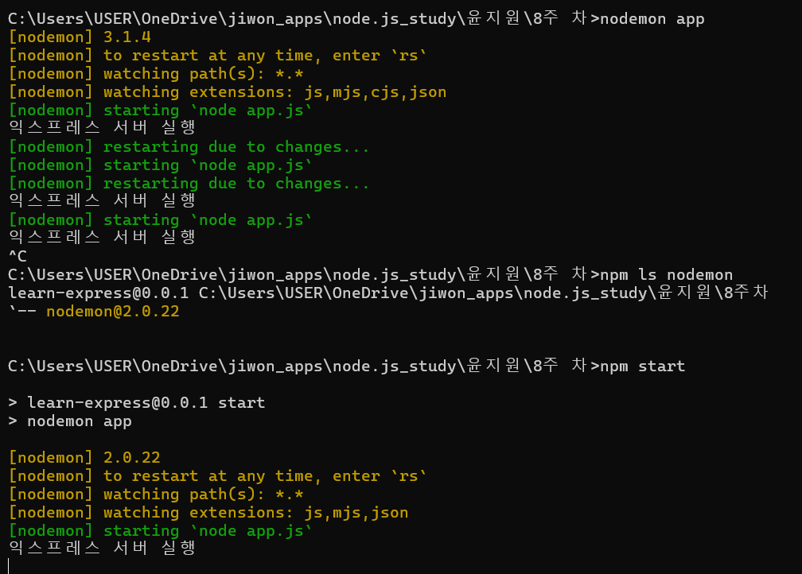

## EXPRESS 서버 실행하기~!

- package.json, app.js 파일 생성
- package.json 파일 직접 작성 시 콘솔에서 npm i 실행-
- 웹에 localhost:3000 접속
- node app(서버 실행 )- nodemon app( 개발할 때는 보통 nodemon 서버를 많이 씀) 이때 nodemon 설치 vs 터미널 X cmd 창에서 설치 가능
- nodemon 에서 실행한 서버에서는, app.js 에서 get 으로 설정 안 한 부분을 서버측에서 알아서 404를 띄워줌 + app.js 에서 if 문 쓰지 않아도 되게끔 분기처리가 됨
- app.js 파일을 바꾸고 저장 - [nodemon] starting `node app.js` [nodemon] restarting due to changes...

# express 로 html 서빙하기

- res.sendfile-단순한 문자열 대신 HTML 로 응답
- 명령어 npm ls express - 내 프로젝트에서 패키지가 쓰이고 있는지 보는 것 (--empty 가 뜨면 안 쓰고 있는 것 )

# 미들웨어

express 는 기본적으로 위에서 아래로 실행되지만, 미들웨어는 next 매개변수를 설정해줘야지 다음으로 넘어감
/category/:name 이 있고 아래 /category/Javascript 가 있으면 웹에 /category/Javascript 를 쳤을 때 먼저 순서인 /category/:name의 명령이 실행됨

- 라우터들은 res.send 일때 next 매개변수( next())가 없으면 다음 라우터로 안 넘어감
- 따라서 /:name 같은 와일드 카드나 범위가 넓은 라우터들은 다른 라우터들 보다 아래에 위치해야 함. 와일드카드 라우터가 있으면 404가 안 뜸(에러 뜸)
- 미들웨어에 /category 와 같은 주소를 첫 번째 인수로 넣어주지 않으면 모든 요청에서 실행되고,주소를 넣는다면 해당하는 요청에서만 실행된다.
- <순서: 1. app 설정, 2. 앱에 관련된 설정 (set) 3.공통미들웨어 4. 라우터들 설정 (범위 넓은 건 뒤로 ) 5. 에러 미들웨어 설정. 이때 에러 미들웨어는 앞에 err 이 매개변수로 들어가 있음. next 매개변수 생략 불가. js 에서는 명시된 매개변수의 개수가 다르면 다른 함수로 간주함
- 한 라우터에 res.send 두번 이상, 또는 res.send + res.json 일때 에러 발생 "cannot set headers after they are sent to the client". 원래 요청 한 번에 응답 한 번이기 때문 . res.writeHead 써도 에러남.
- +팁
  res.json 은 응답을 보내는 것이지 함수 자체를 종료하는 건 아님
  next(error) 처럼 인수가 존재하면 다음 미들웨어로 넘어가는 것이 아니라 그 이름의 미들웨어로 이동
- morgan: 요청과 응답을 기록하는 라우터

# 미들웨어 확장하기

- 미들웨어 안에 미들웨어 넣는 방법
- 아래 두 코드는 동일한 역할
  '''
  app.use(morgan('dev')); //또는
  app.uses((req,res,next)={
  morgan('dev')(req,res,next)
  })
  //자주 쓰이는 미들웨어 확장 형식
  '''
  app.use('/',(req,res,next)=>{
  if(req.session.id){
  express.static(\_dirname,'public')(req,res,next)// 사진 또는 데이터를 프론트로 전달
  } else{
  next();
  }
  });
  '''

# 멀티파트 데이터 형식

form 태그의 enctype 이 multipart/for-data 인 경우 multer 패키지 필요. multer 함수를 호출하면 함수 안에 네 가지의 미들웨어가 들어 있음. multer 안에 diskStorage 에 데이터를 저장함. 특정 폴더에 저장을 한다 그러면 서버를 시작하기 전에 sync 사용해서 업로드 폴더 생성 가능함

# dotenv : 미들웨어는 아니고 비밀 키 등을 관리할 수 있음

소스코드 털릴때 key 들은 관리하기 위해 사용. key들을 환경변수에다 숨겨놓는다 ( process.env.COOKIE_SECRET)
아마존이나 구글 맵 같은 key 들 안 털리게끔 조심하기!!!!
process.env.COOKIE_SECRET 사용하려면 파일에 .env 파일 만들어주기

- 모든 비밀 키들을 .env 파일에 모아주기
- 소스코드에서 process.env 를 쓰는 패키지보다는 dotenv 가 위로 올라가야 함
- .env 는 깃헙에 올리지 말아야 함 ~!

# express.Router

- 라우팅 분리하기: 묶이는 애들끼리 분리
- userRouter 의 get 은 /user 와 / 가 합쳐져서 GET/user/ 가 됨
- 라우트 매개변수 => 동적으로 변하는 부분을 라우트 매개변수로 만듦 . !!일반 라우터보다 뒤에 위치해야 함!!. :id 를 넣으면 req.params.id 로 받을 수 있음 . 주소에 querystring 이 붙으면 req.query 로 받음
- 404 미들웨어는 모든 라우터 뒤에 위치
- 주소는 같지만 메서드가 다른 코드가 있을 때 : router.route 로 묶음 . router.route('/abc') => 주소를 먼저 씀

# pug, nunjucks는 생략

# 에러 처리 미들웨어:

- 변수에 에러에 대한 메세지와 에러 자체에 대한 것도 넣음. + 404 인지 500인지 status를 넣은 뒤 에러 rendering =>
  개발 중일때는 메세지가 뜨고, 배포일 때는 빈 객체가 뜨게끔 함.
